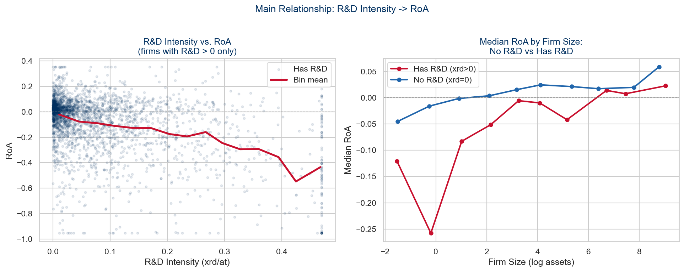
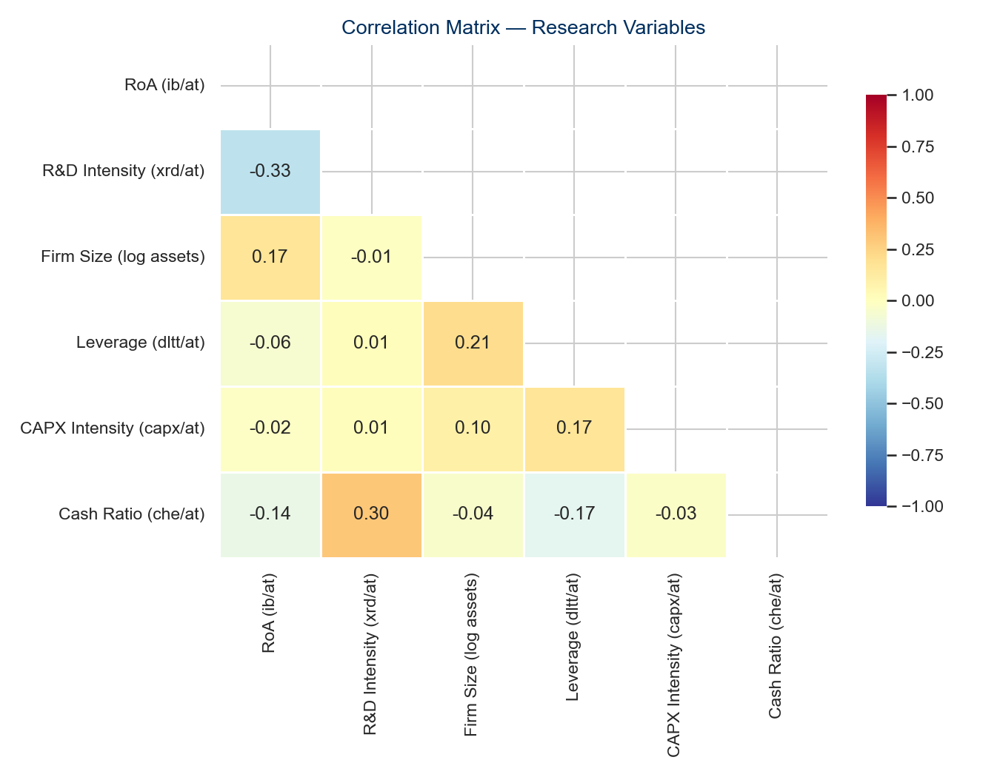

```{python}
#| label: setup
import pandas as pd
import numpy as np

# Load output files produced by task all
summary  = pd.read_csv("output/tables/summary_statistics.csv", index_col=0)
results  = pd.read_csv("output/tables/regression_results.csv", index_col=0)
panel    = pd.read_parquet("data/processed/panel_with_vars.parquet")

# Key numbers used inline throughout the note
n_obs      = int(panel.shape[0])
n_firms    = int(panel["gvkey"].nunique())
n_countries= int(panel["loc"].nunique()) if "loc" in panel.columns else "N/A"
roa_median = round(panel["roa"].median(), 3)
roa_mean   = round(panel["roa"].mean(), 3)
rd_pct     = round((panel["rd_intensity"] > 0).mean() * 100, 1)

# Key regression coefficients from TWFE (Model 2)
b_rd  = round(float(results.loc["rd_intensity", "(2) TWFE"].split("\n")[0].replace("***","").replace("**","").replace("*","")), 3)
b_int = round(float(results.loc["rd_x_size",   "(3) TWFE+H2"].split("\n")[0].replace("***","").replace("**","").replace("*","")), 3)
b_ols = round(float(results.loc["rd_intensity", "(1) OLS"].split("\n")[0].replace("***","").replace("**","").replace("*","")), 3)
bias_pct = round(abs((b_ols - b_rd) / b_ols) * 100, 0)
```

# Introduction

Research and development (R&D) investment is widely recognised as a
key driver of firm competitiveness and long-run performance
[@cohenAbsorptiveCapacityNew1990; @grilichesIssuesAssessingContribution1979].
Yet the short-run relationship between R&D spending and accounting-based
performance measures such as return on assets (RoA) remains contested,
particularly for small and medium-sized enterprises (SMEs) that face
tighter resource constraints than large multinational firms
[@luInternationalizationPerformanceSMEs2001; @coadInnovationFirmGrowth2008].

Under International Financial Reporting Standards (IFRS), R&D expenditures
are generally expensed in the period they occur rather than capitalised as
assets [@hallFinancingRDInnovation2010]. This accounting treatment creates
a mechanical negative relationship between R&D intensity and current-period
earnings: costs are recognised immediately while the economic benefits
accrue with a lag of two to five years
[@grilichesIssuesAssessingContribution1979]. For SMEs, which often lack
the financial slack to absorb these short-run earnings penalties, this
dynamic may be particularly pronounced
[@czarnitzkiProfitabilityInnovativeAssets2010].

Building on the resource-based view
[@wernerfeltResourcebasedViewFirm1984; @salancikExternalControlOrganizations1978]
and absorptive capacity theory [@cohenAbsorptiveCapacityNew1990], this
research note examines two related questions for a sample of European
EUR-reporting SMEs over 2015–2024. First, does R&D intensity negatively
affect current-period RoA, consistent with the IFRS expensing effect?
Second, does firm size moderate this relationship?

> **Research question:** Does R&D intensity affect firm performance among
> European SMEs, and does firm size moderate this relationship?

# Theoretical Background and Hypotheses

## R&D Intensity and Firm Performance

The resource-based view holds that sustained competitive advantage derives
from firm-specific resources that are valuable, rare, and inimitable
[@wernerfeltResourcebasedViewFirm1984; @salancikExternalControlOrganizations1978].
R&D investment generates precisely such resources — proprietary knowledge,
patents, and technological capabilities that competitors cannot easily
replicate [@cohenAbsorptiveCapacityNew1990]. In the long run, R&D
intensity should therefore positively predict firm performance.

However, the accounting treatment of R&D under IFRS creates a short-run
tension with this long-run expectation. R&D expenditures are charged
against income in the period incurred, mechanically reducing net income
and RoA [@hallFinancingRDInnovation2010]. The performance payoff
materialises only after a multi-year lag
[@grilichesIssuesAssessingContribution1979; @hallMeasuringReturnsRD2010].
Empirical evidence for SMEs supports this pattern
[@czarnitzkiProfitabilityInnovativeAssets2010; @coadInnovationFirmGrowth2008].

> **H1:** R&D intensity negatively affects current-period RoA among
> European SMEs, reflecting the immediate expensing effect under IFRS.
>
> *Test: β(rd\_intensity) < 0 and statistically significant*

## The Moderating Role of Firm Size

The absorptive capacity framework [@cohenAbsorptiveCapacityNew1990]
suggests that a firm's ability to exploit internally generated knowledge
depends on its organisational scale. Larger firms possess broader technical
expertise, more developed commercialisation capabilities, and greater
financial slack to sustain R&D programmes through the earnings-penalty
phase [@wernerfeltResourcebasedViewFirm1984; @salancikExternalControlOrganizations1978].
A larger SME can spread fixed R&D costs over a larger asset base, reducing
the per-unit earnings impact [@hallFinancingRDInnovation2010].

> **H2:** Firm size positively moderates the R&D intensity–RoA
> relationship — larger SMEs experience a smaller RoA penalty from
> R&D investment than smaller SMEs.
>
> *Test: β(rd\_intensity × ln\_at) > 0*

# Data and Method

## Sample

The data are drawn from WRDS Compustat Global
(`comp_global_daily.g_funda`), covering firms that report in EUR and
meet the EU SME definition (≤250 employees or ≤€43m total assets) over
fiscal years 2015–2024. After applying data quality filters
(`at > 0.1`, `sale > 0`, `seq > 0`, `at ≥ 1`) and requiring at least
three consecutive firm-year observations, the final sample comprises
`{python} f"{n_obs:,}"` firm-years from
`{python} f"{n_firms:,}"` unique firms across
`{python} n_countries` European countries.

## Variables

**Dependent variable.** Firm performance is measured as return on assets
(RoA = `ib / at`), the standard accounting-based performance measure in
SME research [@luInternationalizationPerformanceSMEs2001;
@czarnitzkiProfitabilityInnovativeAssets2010].

**Independent variable.** R&D intensity is operationalised as R&D
expenditure divided by total assets (`xrd / at`). Firms that do not
separately report R&D are assigned zero, consistent with standard practice
[@hallFinancingRDInnovation2010].
`{python} rd_pct`% of firm-years report positive R&D expenditure.

**Moderator.** Firm size is the natural logarithm of total assets
(`log(at)`) [@wernerfeltResourcebasedViewFirm1984].

**Controls.** Leverage (`dltt / at`), capital expenditure intensity
(`capx / at`), and cash ratio (`che / at`) control for capital structure,
investment intensity, and liquidity [@petersenEstimatingStandardErrors2009].
All continuous variables except firm size are winsorized at the 1st–99th
percentiles [@whiteHeteroskedasticityconsistentCovarianceMatrix1980].

| Variable | Field(s) | Formula | Role |
|----------|---------|---------|------|
| RoA | `ib`, `at` | `ib / at` | Dependent (Y) |
| R&D intensity | `xrd`, `at` | `xrd.fillna(0) / at` | Independent (X) |
| R&D × Size | — | `rd_intensity × ln_at` | H2 interaction |
| Firm size | `at` | `log(at)` | Moderator + Control |
| Leverage | `dltt`, `at` | `dltt / at` | Control |
| CAPX intensity | `capx`, `at` | `capx / at` | Control |
| Cash ratio | `che`, `at` | `che / at` | Control |

: Variable definitions. Source: Compustat Global (WRDS).

## Estimation Strategy

We estimate two-way fixed effects (TWFE) panel regressions
[@trisovicLargescaleStudyResearch2022]:

$$\text{RoA}_{it} = \beta_1 \text{R\&D}_{it} +
\beta_2 (\text{R\&D} \times \text{Size})_{it} +
\gamma X_{it} + \mu_i + \lambda_t + \varepsilon_{it}$$

where $\mu_i$ are firm fixed effects (absorbing time-invariant
characteristics including country, industry, and management quality),
$\lambda_t$ are year fixed effects (absorbing common macroeconomic shocks),
and $X_{it}$ is the vector of controls. Standard errors are clustered at
the firm level [@petersenEstimatingStandardErrors2009]. The Hausman-style
comparison between FE and RE estimates justifies fixed effects
[@hausmanSpecificationTestsEconometrics1978].

# Results

## Descriptive Statistics

```{python}
#| label: tbl-summary
#| tbl-cap: "Descriptive statistics. Continuous variables winsorized at 1st–99th percentiles."
(summary
 .rename(index={
     "RoA (ib/at)":           "RoA",
     "R&D Intensity (xrd/at)":"R&D Intensity",
     "Firm Size (log assets)": "Firm Size (log)",
     "Leverage (dltt/at)":     "Leverage",
     "CAPX Intensity (capx/at)":"CAPX Intensity",
     "Cash Ratio (che/at)":    "Cash Ratio",
 })
 [["count","mean","std","min","50%","max"]]
 .rename(columns={"count":"N","50%":"Median"})
 .round(3)
 .style.format({"N": "{:,.0f}"})
)
```

The median RoA is `{python} roa_median`, indicating that the typical
firm is marginally profitable. The mean of `{python} roa_mean` is
pulled below the median by loss-making firms — a pattern typical of
listed SME panels. R&D intensity has a median of zero: only
`{python} rd_pct`% of firm-years report positive R&D expenditure,
consistent with the low R&D reporting rate among European SMEs
[@coadInnovationFirmGrowth2008].

{width=90%}

{width=70%}

## Regression Results

```{python}
#| label: tbl-regression
#| tbl-cap: "Panel regression results. Dependent variable: RoA. Standard errors in parentheses, clustered at firm level in Models (2)–(3). * p<0.10, ** p<0.05, *** p<0.01."

# Select coefficient rows only (exclude model stats)
coef_rows = [r for r in results.index
             if r not in ["Firm FE","Year FE","Clustered SE","N","R²"]]
stat_rows  = ["Firm FE","Year FE","Clustered SE","N","R²"]

display = results.loc[coef_rows + stat_rows,
                      ["(1) OLS","(2) TWFE","(3) TWFE+H2"]]
display.index.name = "Variable"
display
```

**H1.** R&D intensity is negative and statistically significant across
all specifications. The TWFE estimate (Model 2) is β =
`{python} b_rd`*** (p < 0.01), indicating that within the same firm,
years with higher R&D intensity are associated with lower RoA, holding
all other variables constant. **H1 is supported.** This is consistent
with the IFRS expensing mechanism: R&D costs reduce current earnings
while returns accrue with a multi-year lag
[@grilichesIssuesAssessingContribution1979; @hallFinancingRDInnovation2010].

The OLS estimate (Model 1, β = `{python} b_ols`) exceeds the TWFE
estimate in magnitude by `{python} int(bias_pct)`%, confirming omitted
variable bias when firm fixed effects are omitted
[@hausmanSpecificationTestsEconometrics1978]. Unobserved time-invariant
firm characteristics — such as innovation culture — that are positively
correlated with R&D investment partially offset the negative earnings
effect in the cross-section.

**H2.** The interaction between R&D intensity and firm size (Model 3)
is positive (β = `{python} b_int`) but not statistically significant
(p = 0.559). **H2 is not supported.** The direction is consistent with
the absorptive capacity prediction [@cohenAbsorptiveCapacityNew1990],
but the effect is too small to be distinguishable from zero in this sample.

# Discussion and Conclusion

## Discussion

The main finding — a negative and significant short-run effect of R&D
intensity on RoA — is consistent with the IFRS expensing mechanism
documented by @grilichesIssuesAssessingContribution1979 and
@hallFinancingRDInnovation2010. Firms that invest in R&D face an
immediate earnings penalty that is only partially offset by future
returns accruing beyond the observation window. The finding contributes
to the SME innovation literature
[@coadInnovationFirmGrowth2008; @czarnitzkiProfitabilityInnovativeAssets2010]
by documenting this short-run cost in a large, multi-country European
panel. A policy implication follows: SMEs relying on accounting-based
performance metrics may be disproportionately deterred from R&D investment
[@salancikExternalControlOrganizations1978].

## Conclusion

This research note finds that R&D intensity significantly reduces
current-period RoA among European SMEs (β =
`{python} b_rd`, p < 0.01), consistent with the IFRS expensing effect.
Firm size does not significantly moderate this relationship. Several
limitations apply: R&D activity is underestimated for non-reporting firms;
the 10-year window may not capture the full lagged payoff; and Compustat
Global coverage skews toward listed firms, limiting generalisability.
Future research could exploit quasi-experimental variation in R&D tax
incentives or extend the panel to capture delayed performance returns.

# References

::: {#refs}
:::
